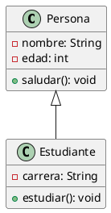

# Herramienta: UML (Unified Modeling Language)

## Introducción
UML es un lenguaje visual estándar para modelar sistemas de software. Permite representar la estructura y comportamiento de un sistema mediante diagramas.

---

## 1. Tipos de Diagramas UML

### 1.1 Diagramas Estructurales
Se enfocan en la estructura estática del sistema.
- **Diagrama de Clases**: Clases, atributos, métodos y relaciones
- **Diagrama de Objetos**: Instancias de clases
- **Diagrama de Componentes**: Componentes del sistema
- **Diagrama de Despliegue**: Infraestructura física

### 1.2 Diagramas de Comportamiento
Se enfocan en el comportamiento dinámico del sistema.
- **Diagrama de Casos de Uso**: Interacción entre actores y sistema
- **Diagrama de Secuencia**: Intercambio de mensajes en el tiempo
- **Diagrama de Actividades**: Flujo de actividades (similar a diagramas de flujo)
- **Diagrama de Estados**: Estados y transiciones de un objeto

---

## 2. Diagrama de Clases (Más Común en POO)

### 2.1 Elementos Básicos
```
+-------------------+
|      Persona      |
+-------------------+
| - nombre: String  |
| - edad: int       |
+-------------------+
| + saludar(): void |
| + getEdad(): int  |
+-------------------+
```

### 2.2 Visibilidad
- `+`: Pública (public)
- `-`: Privada (private)
- `#`: Protegida (protected)
- `~`: Paquete (package/default)

### 2.3 Relaciones
- **Asociación**: Conexión básica (línea sólida)
- **Herencia**: Especialización (flecha con triángulo hueco)
- **Implementación**: Clase implementa interfaz (flecha punteada con triángulo)
- **Agregación**: "Tiene un" (rombo hueco)
- **Composición**: "Parte de" (rombo sólido)

---

## 3. Ejemplo: Sistema de Biblioteca

```
+-------------------+       +-------------------+
|     Libro         |       |    Usuario        |
+-------------------+       +-------------------+
| - titulo: String  |       | - nombre: String  |
| - autor: String   |       | - id: int         |
+-------------------+       +-------------------+
| + prestar(): void |       | + solicitar(): void|
+-------------------+       +-------------------+
         |                           |
         |                           |
         v                           v
+-------------------+
|    Préstamo       |
+-------------------+
| - fecha: Date     |
+-------------------+
| + crear(): void   |
+-------------------+
```

---

## 4. Diagrama de Casos de Uso

### 4.1 Elementos
- **Actor**: Entidad externa que interactúa con el sistema (persona, otro sistema)
- **Caso de Uso**: Funcionalidad que el sistema proporciona

### 4.2 Ejemplo
```
[Usuario] -----> (Buscar Libro)
[Usuario] -----> (Solicitar Préstamo)
[Usuario] -----> (Devolver Libro)
[Bibliotecario] -> (Gestionar Libros)
```

---

## 5. Diagrama de Secuencia

### 5.1 Elementos
- **Líneas de vida**: Representan objetos participantes
- **Mensajes**: Flechas entre líneas de vida
- **Barras de activación**: Periodo durante el cual el objeto está activo

### 5.2 Ejemplo (Simplificado)
```
Usuario    Sistema    Base de Datos
  |           |           |
  |--Login--->|           |
  |           |--Query--->|
  |           |<--Data---|
  |<--OK------|           |
```

---

## 6. Herramientas para UML

### 6.1 Herramientas Gratuitas
- **draw.io (diagrams.net)**: En línea, sin registro
- **StarUML**: Popular, versión gratuita limitada
- **PlantUML**: Genera diagramas desde código (texto)

### 6.2 Herramientas Comerciales
- **Enterprise Architect**
- **Visual Paradigm**

---

## 7. Ejemplo con PlantUML



---

## 8. Recursos de Aprendizaje
- Libro: "UML Distilled" (Martin Fowler)
- Tutorial: tutorialspoint.com/uml/
- Práctica: Modelar un sistema simple (ej. gestión de tareas)
